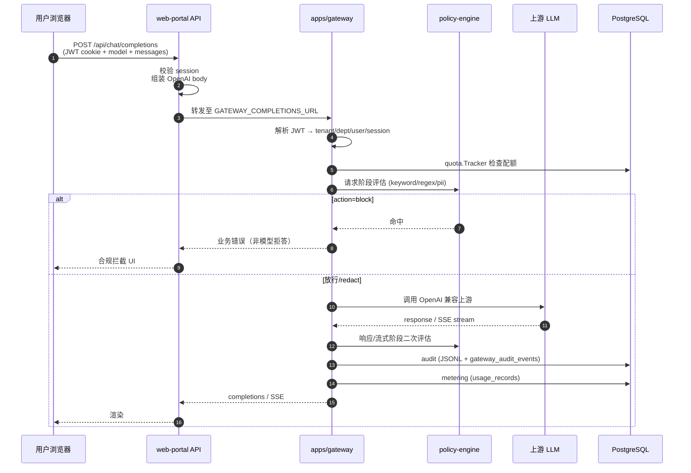
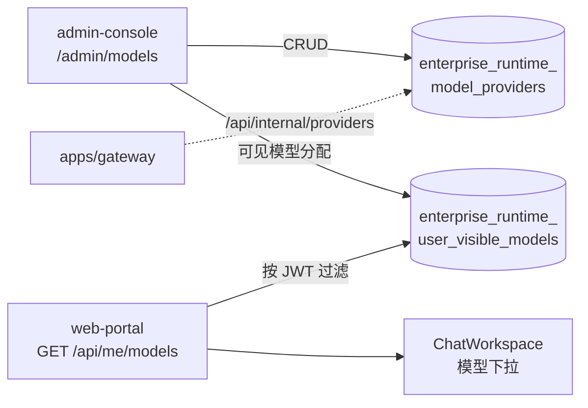
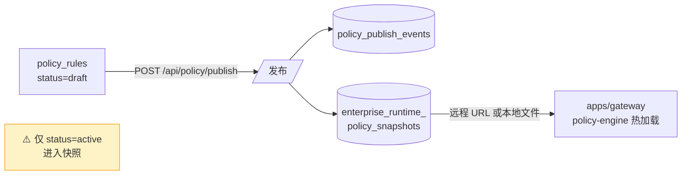
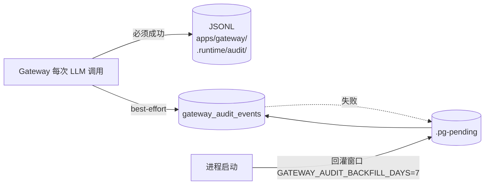
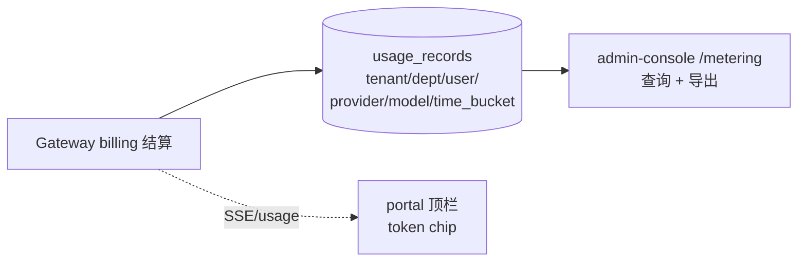
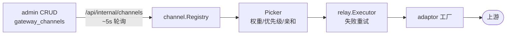
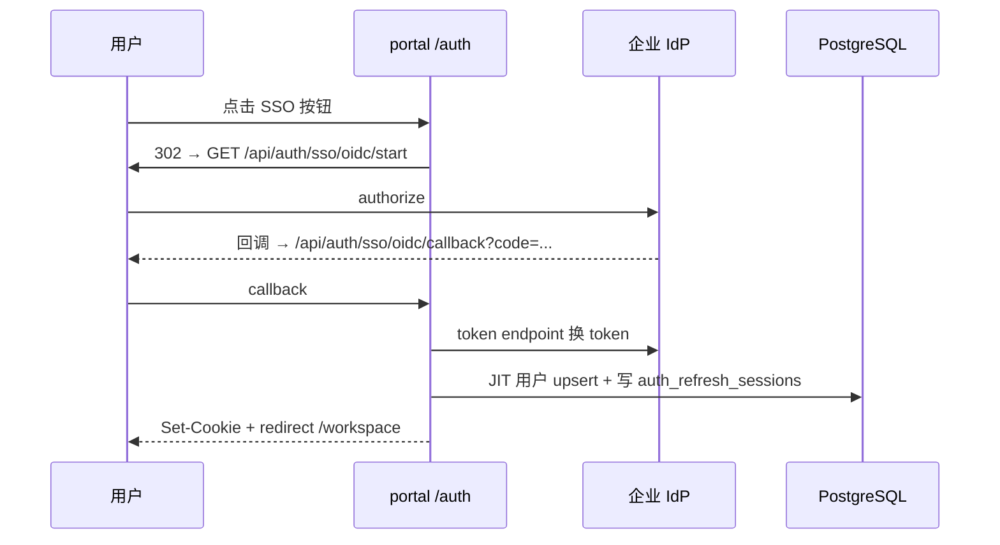

# Enterprise 数据流

> 最后更新：2026-05-21

本文描述一次完整聊天请求及关联子系统的数据流向。

---

## 1. 聊天 completions 主链路



### Portal 侧会话持久化

聊天历史**不经过 Gateway 持久化**，由 portal API 写入 PG：

- `POST /api/chat/sessions` → `chat_sessions`
- `POST /api/chat/sessions/:id/messages` → `chat_messages`

Gateway 只负责推理、策略、审计、计量。

---

## 2. 模型可见性



Gateway 侧通过 internal API 或 PG 读取 provider 配置（含 `api_key_cipher` 解密），与 portal 可见性**独立**：portal 控制「用户能看到哪些 model id」，gateway 控制「哪些 upstream 可调用」。

---

## 3. 策略发布流



**注意**：`blocked=true` 仅当 action 为 **block**；warn/redact 可有 hits 但不拦截。

测试：`POST /api/policy/test` 合并表单预览与库内规则，避免「界面选拦截仍按旧动作计算」。

---

## 4. 审计双写



admin-console `/audit` 查询走 PG `PgAuditStore`，可见域依赖 scope：

- `audit:read:all` — 全租户
- `audit:read:dept` — 本部门
- 旧 `audit:read`  alone 可能导致部门场景 403

IAM 管理操作审计在**另一张表** `audit_events`，与 gateway 审计分表。

---

## 5. Token 计量



配额：`enterprise_runtime_token_quotas` → gateway `quota.Tracker`。当前以**租户级**为主；部门/用户级 TPM 需独立规划。

---

## 6. Channel 中继（可选）

启用 `GATEWAY_CHANNEL_REGISTRY=on` 时：



详见 [runbooks/gateway-channel-relay.md](../runbooks/gateway-channel-relay.md)。

---

## 7. SSO 登录流（OIDC 示例）



Admin 侧镜像路由在 `:3001`，Provider CRUD 在 `/settings/sso` + `/api/admin/sso/providers/*`。

---

## 8. Legacy JSON 迁移流

```
.runtime/admin/*.json  (历史本地文件)
  ▼
migrate-runtime-legacy.ts  (bootstrap / start-dev 自动触发)
  ▼
enterprise_runtime_* 表
  ▼
admin / portal / gateway 只读 PG
```
