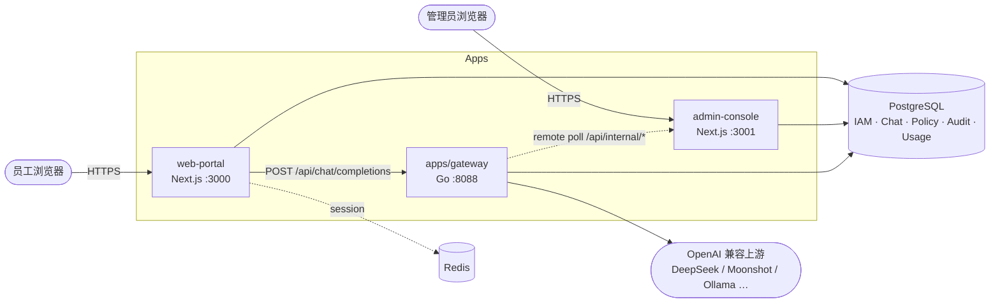

# Enterprise 架构总览

## 1. 产品定位

AgenticX Enterprise 面向企业客户，提供：

1. **员工前台** — Web 聊天工作区、模型选择、会话历史
2. **管理后台** — IAM、策略规则、审计、计量、模型服务、Channel 管理
3. **AI 网关** — OpenAI 兼容 API、策略评估、审计链、Token 计量、多上游路由

护城河是与 Machi Desktop 的三端联动（云端管控 + 端侧安全闭环），商业模式为**开源主干 + 客户专属定制**（`customers/*` 私有仓）。

---

## 2. 组件拓扑



### 端口与进程

| 组件 | 端口 | 技术栈 | Workspace |
|---|---|---|---|
| web-portal | 3000 | Next.js 15 | pnpm |
| admin-console | 3001 | Next.js 15 | pnpm |
| gateway | 8088 | Go 1.25 + chi | go.mod（独立） |
| edge-agent | 7823（设计） | Go skeleton | 未纳入 workspace |
| Postgres | 5432 | Docker compose dev | — |
| Redis | 6379 | Docker compose dev | — |

---

## 3. Monorepo 结构

```
enterprise/
├── apps/           # 可部署整机
├── features/       # 业务功能域（客户挪用主单元）
├── packages/       # 技术零件
├── plugins/        # 运行时 manifest（rule-pack 等）
├── deploy/         # docker-compose + nginx 模板
├── scripts/        # bootstrap / start-dev / E2E
└── docs/           # 本文档树
```

**pnpm workspace**（`pnpm-workspace.yaml`）纳入：`apps/*`、`features/*`、`packages/*`、`plugins/*`，以及可选的 `../customers/*/apps/*`。

**不纳入 workspace**：

- `apps/gateway` — Go 模块，`go build` 独立构建
- `packages/sdk-py` — Python，`pyproject.toml` 管理

**Turbo tasks**：`build`、`dev`（persistent）、`lint`、`typecheck`、`test`、`clean`。

---

## 4. 分层设计

### 4.1 Apps（组装层）

Next.js 应用负责路由、Session、RBAC 中间件，调用 features 与 packages。业务 store 部分仍在 app 内（如 `admin-console/lib/*-store.ts`），逐步向 features 迁移。

### 4.2 Features（业务域）

> 状态图例：✅ 已实现 · 🟡 部分 · ⚪ Stub · ⛔ Skeleton

| Feature | 职责 | 状态 |
|---|---|---|
| iam | 用户/部门/角色/批量导入 | ✅ |
| chat | 聊天工作区 UI + store | ✅ |
| policy | 策略 PG 存储 + 快照发布 | ✅ |
| audit | 网关审计查询 | ✅ |
| metering | Token 四维查询 | ✅ |
| model-service | Provider 管理 | ⚪（逻辑在 admin-console） |
| knowledge-base | 知识库 | ⚪ |
| tools-mcp | 工具/MCP | ⚪ |
| agents | 智能体 | ⚪ |
| settings | 设置面板 | ⚪（portal 有本地组件） |

### 4.3 Packages（技术零件）

| Package | 职责 |
|---|---|
| ui | shadcn 原语 + OKLCH 主题 + AppShell |
| auth | JWT、OIDC/SAML、Next middleware |
| db-schema | Drizzle schema + migrations |
| iam-core | PG repos、scope-registry、runtime 迁移 |
| core-api | 跨端类型契约 |
| policy-engine | Go 策略引擎（gateway 依赖） |
| config / branding / telemetry / sdk-* | 部分 stub |

### 4.4 Plugins（规则包）

YAML manifest 定义 `rule-pack` / `tool-pack` / `theme-pack`。Gateway 启动时加载 `plugins/moderation-*/manifest.yaml`，admin 策略中心可发布 PG 快照覆盖/扩展。

---

## 5. 认证与租户模型

- **JWT**：RS256，密钥对由 `bootstrap.sh` 生成至 `.local-secrets/`，环境变量 `AUTH_JWT_PRIVATE_KEY` / `AUTH_JWT_PUBLIC_KEY`
- **Claims**：`tenant_id`、`dept_id`、`user_id`、`session_id`、scopes
- **Portal**：密码登录 + OIDC/SAML SSO；refresh token 存 PG `auth_refresh_sessions`（支持 serverless 多副本）
- **Admin**：独立 session（`ADMIN_CONSOLE_SESSION_SECRET`）+ 同等 SSO 入口
- **Gateway**：校验 JWT public key，透传主体四维到审计与配额

**Seed 边界**：`db:seed` 仅写入默认租户与 owner（含 `*` scope）；多级部门 / 多角色 / 演示用户由可选脚本 `iam-demo-seed.mjs` 注入（`reset-dev-data.sh --with-iam-seed`）。开发登录见根 [README.md](../../README.md)。

---

## 6. 运行时配置单一数据源

以下配置**以 Postgres 为准**（表 `enterprise_runtime_*`）：

| 配置项 | PG 表 | 原 JSON 路径 |
|---|---|---|
| 模型服务商 | `enterprise_runtime_model_providers` | `.runtime/admin/providers.json` |
| 用户可见模型 | `enterprise_runtime_user_visible_models` | `.runtime/admin/user-models.json` |
| Token 配额 | `enterprise_runtime_token_quotas` | `.runtime/admin/quotas.json` |
| 策略快照 | `enterprise_runtime_policy_snapshots` | `.runtime/admin/policy-snapshot.json` |
| Gateway Channel | `gateway_channels` | — |

Legacy JSON 通过 `pnpm migrate:legacy-runtime` 幂等导入。Gateway 每 ~5s 轮询 admin internal API 或读 PG/本地文件。

---

## 7. 部署模式

| 模式 | 说明 |
|---|---|
| 本地一体 | `start-dev-with-infra.sh`：Docker PG/Redis + 三进程 |
| Vercel 分体 | portal/admin 上 Vercel；gateway 自建/Fly；`GATEWAY_REMOTE_*_URL` 拉配置 |
| Docker prod | `deploy/docker-compose/prod.yml` 模板（nginx + 双 gateway + 前后台） |

Helm chart **尚未提供**（README 架构图预留位）。

---

## 8. 相关文档

- [data-flow.md](./data-flow.md) — 请求链路详解
- [../apps/README.md](../apps/README.md) — 各 app 详情
- [../gateway/overview.md](../gateway/overview.md) — 网关深度
- [../database/schema.md](../database/schema.md) — 表结构
- 主仓产品架构：`../../docs/plans/2026-04-21-agenticx-enterprise-architecture.md`
