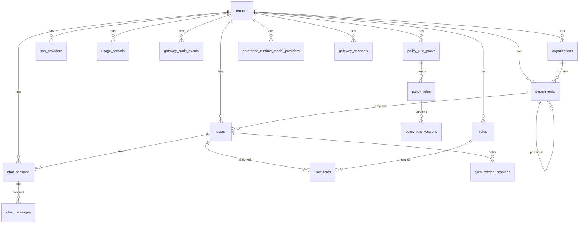

# 数据库 Schema

> 最后更新：2026-05-21 · 对应代码：`packages/db-schema/src/schema/*`

ORM：**Drizzle ORM** + PostgreSQL  
包：`@agenticx/db-schema`（`packages/db-schema/`）  
迁移：`packages/db-schema/drizzle/`（`0000` → `0011_gateway_channels.sql`）

---

## 1. 迁移与 Seed

```bash
# bootstrap.sh 自动执行
pnpm --filter @agenticx/db-schema db:migrate
pnpm --filter @agenticx/db-schema db:seed
```

| Seed 脚本 | 写入内容 |
|---|---|
| `scripts/db-seed.mjs` | 默认租户、owner 用户、`owner` 角色（含 `*` scope） |
| `scripts/iam-demo-seed.mjs`（可选） | 多级部门、4 个角色、10 个演示用户；通过 `reset-dev-data.sh --with-iam-seed` 触发 |

---

## 2. 表清单（共 22 张）

### 2.1 IAM 核心（7）

| 表 | 关键字段 | 说明 |
|---|---|---|
| `tenants` | `id`, `code`, `name`, `plan` | 租户 |
| `organizations` | `id`, `tenant_id`, `name` | 组织 |
| `departments` | `id`, `tenant_id`, `org_id`, `parent_id`, `path` | 部门树（含路径） |
| `users` | `id`, `tenant_id`, `dept_id`, `email`, `display_name`, `password_hash`, `status`, `phone`, `employee_no`, `job_title`, `failed_login_count`, `locked_until`, `is_deleted`, `deleted_at` | 用户（含软删除 + 登录锁定） |
| `roles` | `id`, `tenant_id`, `code`, `name`, `scopes` jsonb, `immutable` | `immutable=true` 为系统角色不可删 |
| `user_roles` | `user_id`, `role_id`, `scope_org_id`, `scope_dept_id` | 多角色，支持范围限定 |
| `sso_providers` | `id`, `tenant_id`, `provider_type`(oidc/saml), `client_secret_cipher` | Client secret AES-GCM 加密 |

### 2.2 聊天（2）

| 表 | 关键字段 | 说明 |
|---|---|---|
| `chat_sessions` | `id`, `tenant_id`, `user_id`, `title`, `active_model`, `message_count`, `last_message_at`, `deleted_at` | 软删除；`active_model` 记忆当前模型 |
| `chat_messages` | `id`, `session_id`, `role`, `content`, `model`, `metadata` jsonb | 完整消息历史 |

### 2.3 计量（1）

| 表 | 关键字段 | 说明 |
|---|---|---|
| `usage_records` | `tenant_id`, `dept_id`, `user_id`, `provider`, `model`, `route`, `time_bucket`, `input_tokens`/`output_tokens`/`total_tokens` numeric(20,0), `cost_usd` numeric(18,8) | 五维聚合 |

### 2.4 审计（分两表）

| 表 | 关键字段 | 说明 |
|---|---|---|
| `audit_events` | actor, target_kind, detail | **IAM 管理操作**审计（admin CRUD） |
| `gateway_audit_events` | `event_time`, `event_type`, `user_id`, `user_email`, `department_id`, `session_id`, `client_type`, `client_ip`, `provider`, `model`, `route`, `input/output/total_tokens`, `latency_ms`, `digest` jsonb, `policies_hit` jsonb (GIN 索引), `tools_called` jsonb, `prev_checksum`, `checksum`, `signature` | **LLM 调用**审计；Blake2b 链 |

> ⚠️ 两表用途不同：admin `/audit` 页面查的是 `gateway_audit_events`；IAM 操作日志走 `audit_events`。

### 2.5 策略（4）

| 表 | 关键字段 | 说明 |
|---|---|---|
| `policy_rule_packs` | `code`, `name`, `source`, `enabled`, `applies_to` jsonb | 规则包 |
| `policy_rules` | `pack_id`, `code`, `kind`, `action`, `severity`, `message`, `payload` jsonb, `applies_to` jsonb, `status`(draft/active), `updated_by` | 单条规则 |
| `policy_rule_versions` | `rule_id`, `version`, `snapshot` jsonb, `author` | 每次保存留版 |
| `policy_publish_events` | `snapshot` jsonb | 发布历史 |

`applies_to` 字段（`PolicyAppliesTo` 类型）：

```ts
{
  version?: number;
  departmentIds?: string[];
  departmentRecursive?: boolean;
  roleCodes?: string[];
  userIds?: string[];
  userExcludeIds?: string[];
  clientTypes?: string[];
  stages?: string[];
}
```

### 2.6 运行时配置（6，从 JSON 升级到 PG）

| 表 | 原 JSON | 关键字段 |
|---|---|---|
| `enterprise_runtime_model_providers` | `providers.json` | `tenant_id`, `provider_id`, `display_name`, `base_url`, `api_key_cipher`, `enabled`, `is_default`, `route`, `env_key`, `models` jsonb |
| `enterprise_runtime_user_visible_models` | `user-models.json` | `tenant_id`, `assignment_key`(user ulid 或 `email:xxx`), `model_id` — 复合主键 |
| `enterprise_runtime_token_quotas` | `quotas.json` | `tenant_id` 主键, `config` jsonb |
| `enterprise_runtime_policy_snapshots` | `policy-snapshot.json` | `tenant_id` 主键, `snapshot` jsonb |
| `auth_refresh_sessions` | — | `session_id`, `user_id`, `tenant_id`, `dept_id`, `email`, `scopes_json`, `expires_at`（serverless 多副本 refresh） |
| `gateway_channels` | — | `id`, `tenant_id`, `name`, `provider_type`(默认 `openai`), `base_url`, `api_key_cipher`, `weight`, `priority`, `status`(active/disabled), `supported_models` jsonb, `metadata` jsonb |

迁移 CLI：

```bash
pnpm -C enterprise migrate:legacy-runtime
```

由 `bootstrap.sh` 与 `start-dev.sh`（仅本地 DB）自动触发；幂等。

---

## 3. ER 关系（Mermaid）



---

## 4. 共享列约定（`_shared.ts`）

| Helper | 列 |
|---|---|
| `ulid(name)` | `varchar(26)` — 用于所有主键/FK |
| `auditColumns` | `created_at`, `updated_at`（withTimezone, defaultNow） |
| `softDeleteColumns` | `is_deleted` boolean, `deleted_at` timestamptz |

---

## 5. 租户隔离规则

- 业务表均带 `tenant_id` FK → `tenants.id`，删除策略多为 `RESTRICT`（避免误清）
- 复合唯一索引常包含 `tenant_id`（如 `users_tenant_email_uq`）
- API 层从 JWT 注入 tenant；服务端禁止跨租户读写
- 多租户扩展：Internal API 当前单租户部署返回整租户数据；如需多租户分发，由调用方传 `tenant_id` 过滤（以实现为准）

---

## 6. 加密字段

| 字段 | 算法 | 密钥环境变量 |
|---|---|---|
| `enterprise_runtime_model_providers.api_key_cipher` | AES-256-GCM | `AGX_PROVIDER_SECRET_KEY` |
| `gateway_channels.api_key_cipher` | AES-256-GCM | `AGX_PROVIDER_SECRET_KEY` |
| `sso_providers.client_secret_cipher` | AES-256-GCM | `SSO_PROVIDER_SECRET_KEY` |

密钥轮换：需重新加密所有现存行；建议通过运维脚本批处理。

---

## 7. 源码索引

| 文件 | 涉及表 |
|---|---|
| `schema/tenants.ts` | tenants |
| `schema/organizations.ts` | organizations |
| `schema/departments.ts` | departments |
| `schema/users.ts` | users |
| `schema/roles.ts` | roles |
| `schema/user-roles.ts` | user_roles |
| `schema/sso-providers.ts` | sso_providers |
| `schema/chat-sessions.ts` | chat_sessions |
| `schema/chat-messages.ts` | chat_messages |
| `schema/usage-records.ts` | usage_records |
| `schema/audit-events.ts` | audit_events |
| `schema/gateway-audit-events.ts` | gateway_audit_events |
| `schema/policy.ts` | policy_rule_packs, policy_rules, policy_rule_versions, policy_publish_events |
| `schema/runtime-config.ts` | enterprise_runtime_*, auth_refresh_sessions |
| `schema/gateway-channels.ts` | gateway_channels |

导出汇总：`schema/index.ts`

---

## 8. 相关文档

- [../gateway/runtime-config.md](../gateway/runtime-config.md) — PG 化运行时配置
- [../deployment/supabase-migration-guide.md](../deployment/supabase-migration-guide.md)
- [../runbooks/audit-pg-backfill.md](../runbooks/audit-pg-backfill.md) — 审计 PG 回灌
- [../configuration/env-vars.md](../configuration/env-vars.md) — 环境变量总表
