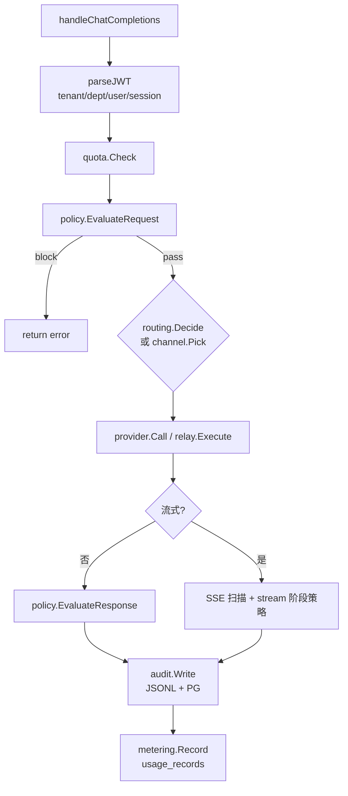
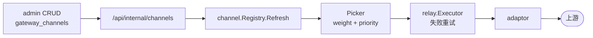

# AI Gateway 架构

源码：`enterprise/apps/gateway/`  
模块：`github.com/agenticx/enterprise/gateway`

---

## 职责

1. **OpenAI 兼容 API** — chat completions + embeddings
2. **三路路由** — local / private-cloud / third-party
3. **Channel 中继** — 多上游权重/优先级/重试
4. **策略引擎** — 请求/响应/流式三通道
5. **审计** — JSONL 必须成功 + PG best-effort + checksum 链
6. **计量** — usage_records / jsonl
7. **配额** — 租户级 tracker（TPM/QPM/并发等，配置驱动）

---

## 包结构

```
apps/gateway/
├── cmd/gateway/main.go
└── internal/
    ├── server/           # HTTP 入口、handlers
    ├── config/           # YAML + env
    ├── provider/         # OpenAICompatibleProvider
    ├── adaptor/          # Channel adaptor 工厂
    ├── channel/          # Registry, Picker, Affinity, Stats
    ├── relay/            # 重试执行器
    ├── keypool/          # 多 Key 池
    ├── billing/          # Token 结算
    ├── routing/          # Decider（header/model/default route）
    ├── runtimeconfig/    # 远程/本地 providers 轮询
    ├── quota/            # Tracker
    ├── metering/         # PG / jsonl sink
    ├── audit/            # Writer, backfill, chain
    └── gatewayinternal/  # HTTP GET + Bearer
```

---

## 请求处理顺序（Chat）



流式路径在 SSE 扫描过程中做 **stream 阶段** 策略评估与分段审计。

---

## 路由决策

`routing.Decider` 优先级（简）：

1. 请求 header 显式 provider
2. `local_route_header` 配置 header 值
3. 模型配置 `Models[].route`
4. `default_route`

路由值：`local`, `private-cloud`, `third-party`（与 provider 表 `route` 字段对齐）。

---

## Channel 中继

启用：`GATEWAY_CHANNEL_REGISTRY=on`



Runbook：[runbooks/gateway-channel-relay.md](../runbooks/gateway-channel-relay.md)

---

## Key 解析优先级

1. PG / remote providers 解密 `api_key_cipher`
2. `<PROVIDER>_API_KEY` 环境变量
3. `LLM_API_KEY`
4. Mock 占位（策略/审计/计量仍执行）

---

## 审计 checksum 链

- 每条 `gateway_audit_events` 含 `checksum`, `prev_checksum`
- 算法：Blake2b（字段结构见 Go struct）
- Admin `GET /api/audit/chain-verify` 全表校验
- PG 写入失败 → `.pg-pending`，启动时 `GATEWAY_AUDIT_BACKFILL_DAYS` 窗口回灌

Runbook：[runbooks/audit-pg-backfill.md](../runbooks/audit-pg-backfill.md)

---

## 与 Python AgenticX 网关差异

| 能力 | Go Enterprise Gateway | Python AgenticX |
|---|---|---|
| 17 种密钥检测 | 部分在 plugins | 框架内置更多 |
| LiteLLM 路由 | 否，OpenAI client | 是 |
| keyword-list kind | 否 | 可能有 |
| extends manifest | 单字符串 | 视 loader |

客户方案勿混述两条线。

---

## 相关文档

- [policy-engine.md](./policy-engine.md)
- [runtime-config.md](./runtime-config.md)
- [../api/gateway.md](../api/gateway.md)
- [../../apps/gateway/README.md](../../apps/gateway/README.md)
